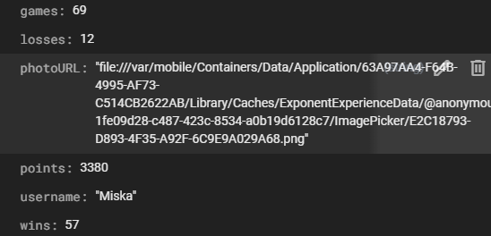
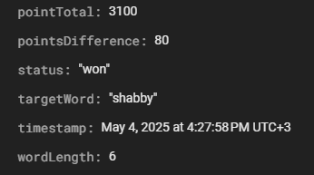

Mobiiliohjelmoinnin projektin palautusrepo.

Projektin yhteydessä täytetty päiväkirja löytyy täältä: [Päiväkirja](./Paivakirja.md)

## Sovelluksen tarkoitus:
Sovelluksen tarkoituksena on tehdä mobiilissa toimiva wordle peli, jossa käyttäjä saa nähdä oman taitotasonsa, näkee pelien tuloksia sekä näkee muiden tulokset. Tämän tarkoituksena on luoda kilpailuhenkeä pelaamiseen. Käyttäjä voi myös mennä asettamaan oman profiilikuvansa ja usernamensa.

Itse wordle peliä on kustomoitu siten, että käyttäjä voi itse valita sanan mitan. Eri mitat antavat eri määrän pisteitä, joten käyttäjän on mahdollista valita haastava ja pitkä sana, jolloin saisi enemmän pisteitä. Pelin sovellus myös hakee sanan tarkoituksen, jolloin käyttäjä voi tutustua siihen, mitä tietty sana oikeasti tarkoittaa ja toivottavasti oppia lisää.

### Pelin eteneminen: 

Käyttäjä painaa Start Game 
-> Modaali aukeaa 
-> Käyttäjä valitsee sanan mitan 
-> Peli alkaa ja käyttäjälle 6 kappaletta yrityksiä 
-> Käyttäjä voittaa tai häviää pelin 
-> Modaali aukeaa, jossa käyttäjän pisteet näytetään 
-> Käyttäjä palaa takaisin alkuun ja voi mennä tarkastelemaan statistiikkaa tai pelata uudelleen

## Käytetyt teknologiat
- React Native
- Expo
- Firebase
- TypeScript
- React

Nämä luovat sovelluksen peruslogiikan ja mahdollistavat ajamisen. Sovellusta ei ole julkaistu ja sen testaamiseksi täytyy käyttää esimerkiksi Expo Go -mobiilisovellusta tai emulaattoreita tietokoneella.

## Kirjastot
- React Native Paper
- Lottie React Native
- React Native Animatable
- React Native Animated Numbers
- React Native Segmented Control
- React Native Reanimated
- React Native Chart Kit

Nämä ovat käyttöliittymään liittyviä. Pyrin käyttämään mahdollisuuksien mukaan React Native Paper komponentteja työssäni, mutta aloittain kustomoinnin vuoksi siellä on mukana jotain react nativen komponentteja myös. Lisäksi käytän jonkin verran animaatioita ja kokeilinkin projektissa hieman eri kirjastojen toimintaa.

- Expo Haptics
- Expo Image Picker
- Expo Sharing
- Expo Splash Screen

Tässä on muutama käyttämäni laiteominaisuus, jotka ovat Expon kautta. Niiden avulla tuodaan lisäarvoa ja laitteen ominaisuuksien hyödyntämistä sovellukseen.

## Kirjatuminen / Reksiteröityminen

Sovellus käyttää firebasen "Authenticationia". Käyttäjä kykenee tässä vaiheessa kirjautumaan sisään VAIN sähköpostilla ja salasanalla. Rekisteröitymisen yhteydessä täytetään 4 kenttää: käyttäjänimi, sähköposti, salasana ja salasana uudelleen.

## Tietokanta

Sovellukseni käyttää Firebasen "Firestore" -nimistä kantaa. En ole tallentanut git repoon sen tarkempia tunnuksia ja ne ovat paikallisesti .env tiedostossani (gitignoressa). Tietokannassa on myös tehty seuraavat käyttöoikeudet:

Kirjautumaton käyttäjä ei kykene näkemään mitään paitsi usernamen hakeminen sallittu (syystä että usernamen tulee olla uniikki ja se tarkastetaan tietokannasta. Tällöin jos tätä ei sallittaisi, ei rekisteröityminen onnistuisi). Kirjautunut käyttäjä puolestaan näkee omat tietonsa ja kykenee muokkaamaan niitä. Poistaminen ei ole sallittua. Jokaisen käyttäjän uid:n alle tallentuu myös kirjautuksia peleistä, joihin kirjautuneella käyttäjälle create ja read oikeudet (omiin peleihin vain). Käyttäjän tiedot (pl. sposti ja salasana) ovat julkista tietoa ja täten kaikki kirjautuneet käyttäjät voivat sitä käyttää. Alla muutama kuva, mitä tietoja tallennetaan. Ensimmäinen on itse käyttäjästä ja toinen puolestaan pelistä.

## Rakenne

Sovellukseni rakenne (alihakemistot) ovat seuraavat:
- Assets = Sisältää kuvia, animaatioita (json) sekä fontit
- Components = Sisältää custom komponentteja joista osa vain yhteen käyttötarkoitukseen ja osa puolestaan laajammassa käytössä.
- Context = Sisältää tässä vaiheessa kaksi kontekstia UserContext ja StatsContext. UserContextissa on listener, joka kuuntelee muutoksia ja statscontext päivittyy kun usercontextissa on muutos. Näiden avulla voidaan välttää prop drilling. Olisin ehkä voinut tehdä vielä gameContextin, jotta pelin kaikkia propseja eri komponenteille yms ei olisi aina tarvinnut tehdä.
- Hooks = Sisältää muutamia hookkeja, joita hyödynnetty työssä.
- Navigators = Sisältää kaksi navigaatiota. Kirjautumattoman käyttäjän Stack ja kirjautuneen käyttäjän stack.
- Screens = Sisältää sovelluksen näytöt. Sovelluksessa tällä hetkellä 7 kappaletta.
- Styles = Sisältää tyylitiedostoja, joita sovelluksessa käytetään.
- Types = Sisältää tyyppimäärityksiä, sillä käytössä on TypeScript
- Utils = Sisältää muutaman kappaleen serviceitä, jotka sisältävät toimintalogiikkaa, kuten vaikka käyttäjän rankin hakeminen. Ne eivät sisällä esimerkiksi tiloja ja täten eivät ole hookkeja.

Näiden lisäksi mainittavia tiedostoja:
- FirebaseConfig.ts = Firebasen vaativa Config, joka keskustelee paikallisen .env tiedoston kanssa.
- App.tsx = Sovelluksen "root". Sisältää esimerkiksi react native paper teeman määrityksiä ja fontteja. Täällä tarkastetaan myös navigaation tyyppi ja se tarjoaa kontekstit.
- metro.config.js = Tiedosto, joka oli pakko tehdä, jotta firebasen auth toimi expon päivityksen SDK 52 -> 53 yhteydessä.